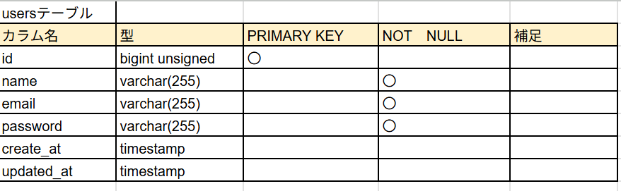
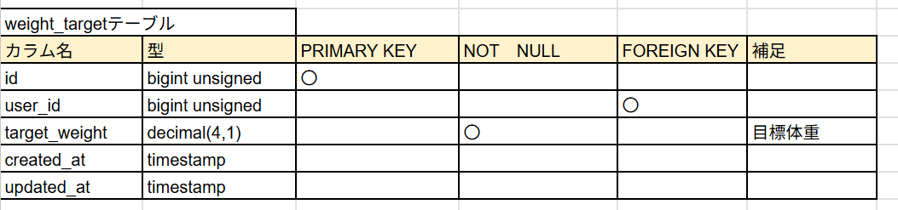
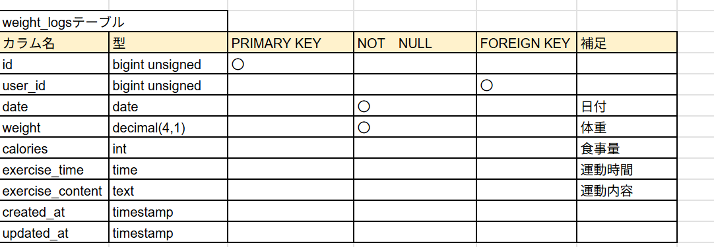

# Pigly

体重記録＆目標管理アプリ

---

## 必要環境

- Docker, Docker Compose
- Git
- （推奨）VSCodeやPHPStormなどのエディタ

---

## クイックスタート

```bash
# 1. 新規ディレクトリ作成＆移動
(例)
mkdir -p ~/coachtech/laravel/testXX  # XXは任意のディレクトリ名
cd ~/coachtech/laravel/testXX

# 2. リポジトリをクローン
git clone git@github.com:starmine448357/Pigly.git

# 3. クローンしたディレクトリに移動
cd Pigly

# 4. .env.example をコピーして .env 作成
cd src
cp .env.example .env

# 5. .envファイルをエディタで開き、DB設定を修正
 例:
 DB_DATABASE=pigly_db
 DB_USERNAME=laravel_user
 DB_PASSWORD=laravel_pass

# 6. Dockerコンテナをビルド＆起動
docker compose up -d --build

# 7. PHPコンテナへ入る
docker compose exec php bash

# 8. Composerインストール（vendorフォルダがなければ）
composer install

# 9. Laravelアプリキー発行
php artisan key:generate

# 10. PHPコンテナからexitしてMySQLコンテナへ
exit
docker compose exec mysql bash

# 11. mysqlコマンドでDB作成/ユーザー作成/権限付与
mysql -u root -p
# （rootパスワードは .env か docker-compose.yml 参照）

CREATE DATABASE IF NOT EXISTS pigly_db CHARACTER SET utf8mb4 COLLATE utf8mb4_unicode_ci;
CREATE USER IF NOT EXISTS 'laravel_user'@'%' IDENTIFIED BY 'laravel_pass';
GRANT ALL PRIVILEGES ON pigly_db.* TO 'laravel_user'@'%';
ALTER USER 'laravel_user'@'%' IDENTIFIED BY 'laravel_pass'; # 必要なら
FLUSH PRIVILEGES;
EXIT;

# 12. PHPコンテナへ再度入る
docker compose exec php bash

# 13. 権限付与（重要！）
chmod -R 777 storage bootstrap/cache

# 14. キャッシュクリア（初回やエラー時のみ）
php artisan cache:clear
php artisan config:clear
php artisan route:clear
php artisan view:clear

# 15. マイグレーション
php artisan migrate

# 16. シーディング（ダミーデータ投入）
php artisan db:seed

・使用技術
PHP 8.3.0

Laravel 8.83.x

MySQL 8.0.x

Docker

### usersテーブル


### weight_targetテーブル


### weight_logsテーブル


### ER図

